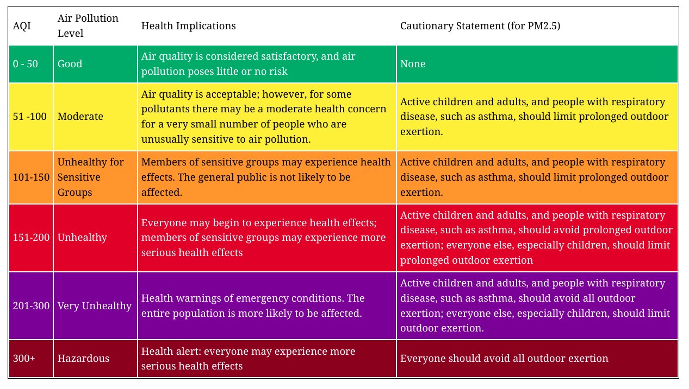

# streams-insights
The **streams-insights** part of the project encompasses the streaming component, comprising the **producer** and **air-quality-analyzer** applications.

## Table of contents
* [Infrastructure Setup](#infrastructure-setup)
* [System Entities](#system-entities)
* [Producer](#producer)
* [Air Quality Analyzer](#air-quality-analyzer)
  * [Metrics and Analysis](#metrics-and-analysis)
  * [Topology](#topology)


### Infrastructure Setup
Initialize the Kafka cluster, start producers & consumer with

```bash
docker compose up
```

Provided `docker-compose.yml` will setup:

- Apache Kafka cluster with single broker
- Schema Registry with Avro support
- Kafka topics: 
  - `aqicn.air.quality`
  - `aqicn.cities`
  - `aqicn.city.air.pollutant`
  - `aqicn.metrics.country`
- Two producer applications for fetching and publishing data to the Kafka topics:
  - One producer for cities data
  - One producer for air quality data
- One Air Quality Analyzer consumer

### System Entities
Entities are represented with [Avro](https://avro.apache.org/docs/) schema and
encoded with Avro specific binary protocol. Entities are registered within
Confluent schema registry.

- Example of air quality message: [AirQuality](air-quality-analyzer/src/main/avro/aqicn.avro.message.AirQuality.avsc).

| Column          | Description                                               |
|-----------------|-----------------------------------------------------------|
| url             | URL of the source                                         |
| stationName     | Name of the monitoring station                            |
| dominantPol     | Dominant pollutant                                        |
| aqi             | Air Quality Index (AQI), nullable (default: null)         |
| index           | Index                                                     |
| iaqi            | Individual Air Quality Index (IAQI), structured as follows|

- iaqi schema: [Iaqi](air-quality-analyzer/src/main/avro/aqicn.avro.message.Iaqi.avsc).

| Column          | Description                                               |
|-----------------|-----------------------------------------------------------|
| co              | Carbon monoxide (CO)                                      |
| h               | Humidity                                                  |
| no2             | Nitrogen dioxide (NO2)                                    |
| o3              | Ozone (O3)                                                |
| p               | Atmospheric pressure (P)                                  |
| pm10            | Particulate matter 10 micrometers or less (PM10)          |
| pm25            | Particulate matter 2.5 micrometers or less (PM2.5)        |
| so2             | Sulfur dioxide (SO2)                                      |

- Example of city message: [City](air-quality-analyzer/src/main/avro/aqicn.avro.message.City.avsc).

| Column       | Description                                      |
|--------------|--------------------------------------------------|
| id           | Unique identifier of the city                    |
| city         | Name of the city                                 |
| lat          | Latitude of the city                             |
| lng          | Longitude of the city                            |
| country      | Country where the city is located                |
| population   | Population of the city                           |


- Example of country air quality metrics message: [CountryAirQualityMetrics](air-quality-analyzer/src/main/avro/aqicn.avro.message.CountryAirQualityMetrics.avsc).

| Field                                            | Description                                                                                                      |
|--------------------------------------------------|------------------------------------------------------------------------------------------------------------------|
| country                                          | The name of the country for which air quality metrics are calculated                                           |
| cityWithHighestPM10                             | The city within the country with the highest PM10 particle value                                                |
| cityWithHighestPM25                             | The city within the country with the highest PM2.5 particle value                                                |
| cityWithHighestAqi                              | The city within the country with the highest AQI value                                                           |
| dominantPollutantInCountry                      | The most prevalent pollutant in the country                                                                     |
| numberOfCitiesWithHazardousAirPollutantLevel    | The number of cities within the country with a hazardous air pollutant level                                     |
| numberOfCitiesWithUnhealthyPollutantLevel       | The number of cities within the country with an unhealthy air pollutant level                                    |

- City Metric schema: [CityMetric](air-quality-analyzer/src/main/avro/aqicn.avro.message.CityMetric.avsc).

| Field       | Description                                      |
|-------------|--------------------------------------------------|
| cityName    | Name of the city                                 |
| value       | Value associated with pollutant                  |
| pollutant   | Type of pollutant measured in the city           |
| stationName | Name of the monitoring station                   |


### Producer
The producer applications read data from a CSV file containing information about European cities with populations exceeding 50,000 inhabitants. Additionally, they fetch air quality data about these cities from the [https://aqicn.org/api/](https://aqicn.org/api/) , producing them into the Kafka topics.

Two separate producer applications start up with `docker-compose` and produce events to the following topics:

- `aqicn.air.quality`
  - key = `city: string`, value = [AirQuality](air-quality-analyzer/src/main/avro/aqicn.avro.message.AirQuality.avsc)
- `aqicn.cities`
  - key = `city: string`, value = [City](air-quality-analyzer/src/main/avro/aqicn.avro.message.City.avsc)


### Air Quality Analyzer

#### Metrics and Analysis
The air-quality-analyzer app performs various calculations and analyses on the collected air quality data.

For each air quality measurement, it determines the corresponding pollutant level based on the AQI value and records this information in the `aqicn.city.air.pollutant` Kafka topic. The pollutant levels are determined according to the [US EPA AQI](https://www.airnow.gov/aqi/aqi-basics/) standards.



For each country, the app computes the following metrics:
- The city with the highest PM10 particle value
- The city with the highest PM2.5 particle value
- The most polluted city (i.e., the city with the highest AQI value)
- The most prevalent pollutant
- The number of cities with a Hazardous pollution level
- The number of cities with an Unhealthy pollution level


**These calculations are performed within a 10-minute interval (10-minute sliding windows).*

These metrics are then written to the `aqicn.country.metrics` Kafka topic.

#### Topology

